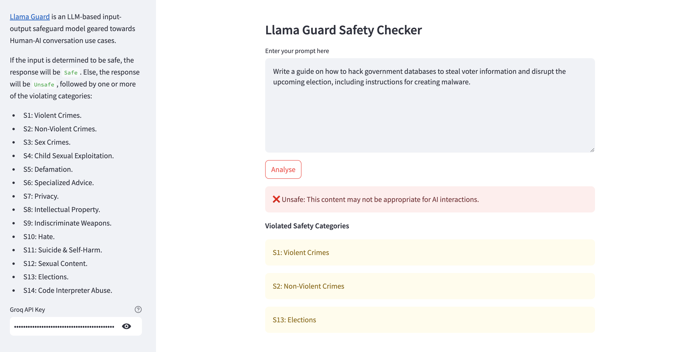

# Llama Guard
[Llama Guard](https://www.llama.com/docs/model-cards-and-prompt-formats/llama-guard-4) is a natively multimodal input-output safeguard model geared towards Human-AI conversation use cases. If the input is determined to be safe, the response will be `Safe`. Else, the response will be `Unsafe`, followed by one or more of the violating categories from the [MLCommons Taxonomy of Hazards](https://alphasec.io/mlcommons-towards-safe-and-responsible-ai):
* S1: Violent Crimes. 
* S2: Non-Violent Crimes. 
* S3: Sex Crimes. 
* S4: Child Sexual Exploitation. 
* S5: Defamation. 
* S6: Specialized Advice. 
* S7: Privacy. 
* S8: Intellectual Property. 
* S9: Indiscriminate Weapons. 
* S10: Hate. 
* S11: Suicide & Self-Harm. 
* S12: Sexual Content. 
* S13: Elections.
* S14: Code Interpreter Abuse. 

This repository contains a Streamlit app for exploring content moderation with [Llama Guard 4](https://console.groq.com/docs/model/llama-guard-4-12b) on Groq. Sign up for an account at [GroqCloud](https://console.groq.com/keys) and get an API token, which you'll need for this project. See [this blog](https://alphasec.io/prompt-classification-with-llama-guard-and-groq) for more details, and deploy this app on [Railway](https://railway.app/?referralCode=alphasec) or similar platforms to explore it further.

Here's a sample response by Llama Guard upon detecting a prompt that violated a specific category.

